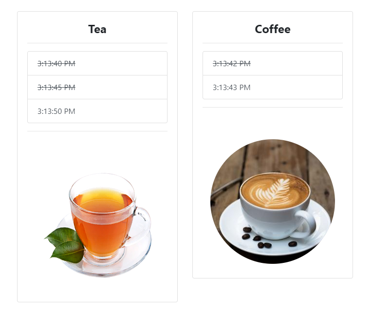

= Beverage Time Tracker

A Javascript application for tracking last prepared beverage time in an office using Javascript ES6, LocalStorage, Bootstrap4, and Jquery.

==== Usage

When someone clicks to a beverage, a new time is being recorded for it to display when it is prepared
and the previous record will be displayed with strikethrough style.

==== Demo
Try on:  https://embed.plnkr.co/WfVwXRc9OQ4xS5dX4EO7/

